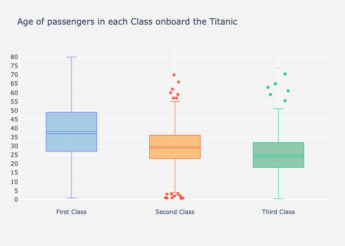
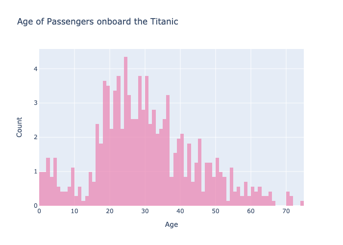

# Titanic Analysis

Fareclass Analysis:
 
 
Survival Rate
sex|age | First | Second | Third
------------ |------------ | ------------- | ------------ | ------------- 
female | 0-18 | 0.909091 | 1.000000 | 0.511628
| | 18-80 | 0.972973 | 0.900000 | 0.423729
male | 0-18 | 0.800000 | 0.600000 | 0.215686
| | 18-80 | 0.375000 | 0.07142 | 0.133663
 
 

Number of survived
 
sex|age | First | Second | Third
------------ |------------ | ------------- | ------------ | ------------- 
female | 0-18 | 11 | 14 | 43
| | 18-80 | 74 | 60 | 59
male | 0-18 | 5 | 15 | 51
| | 18-80 | 96 | 84 | 202

 
 

A box plot of the age of passengers onboard the Titanic according to their class:
 

A histogram of the age of passengers onboard the Titanic according to their class:
 

